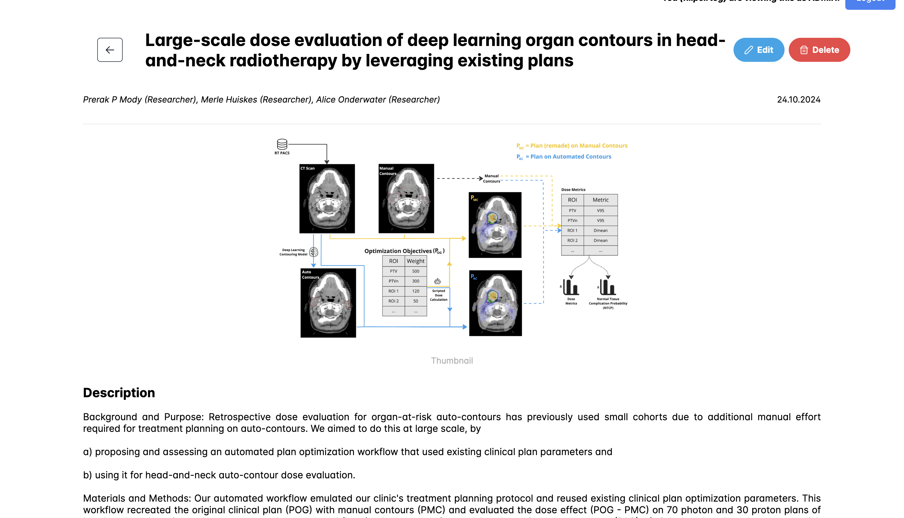

# About Project Portfolio Management System

Project Portfolio Management System is a project developed during the Software Project for the Software Project at Delft
University of Technology for the Computer Graphics and Visualization Course.

The purpose of the app is to store finished projects so that they can be nicely displayed and easily shared, referenced
to future employers or just stored.

A full [Documentation](documentation.md) of the usage and available options of Project Portfolio Management System is available on the wiki.
For help on the most common questions, please refer to the FAQ document.

Today, Project Portfolio Management System is used as a publishing project platform by users worldwide.
## Some of the features

- Login/Logout with session cookies
- Add/Edit/Delete a project which can contain : a title, a description, one or more collaborators, one or more tags,one
  or more images, a bibtex, one or more files)
- Add a tag which contains : a name, a color
- Add a collaborator
- Add a template for projects
- Admin panel where you can configure users permissions
- Help button for additional information

## The Team

- Anton Paul
- Cirtog Filip-Andrei
- Obis Chris
- Ionescu Luca-Serban
- Paramon Bogdan-Luca

# Visuals - Project Screenshots

### Project List

  
  &nbsp; &nbsp; &nbsp; &nbsp;
  

### Project Add

  
  &nbsp; &nbsp; &nbsp; &nbsp;
  

### Project Edit

  
  &nbsp; &nbsp; &nbsp; &nbsp;
  

### Page Detail

  
  &nbsp; &nbsp; &nbsp; &nbsp;
  

### Add Template

  
  &nbsp; &nbsp; &nbsp; &nbsp;
  

## Installation

The Project Portfolio Management System consists of two parts which need to be mandatory running on the same server in
order to ensure the cookies are not marked as third party (used for authentication):

- The backend (developed on Java using SpringBoot and JWT for authentication). For additional instructions for running
  the backend please
  visit [click here](https://gitlab.ewi.tudelft.nl/cse2000-software-project/2023-2024/cluster-b/02a/backend/-/blob/main/README.md?ref_type=heads).

- The frontend (developed on Angular using Nodejs) . For additional instructions for running the backend please
  visit [click here](https://gitlab.ewi.tudelft.nl/cse2000-software-project/2023-2024/cluster-b/02a/frontend/-/blob/main/README.md?ref_type=heads).

## Support

For additional bugs and/or additional new features please do not hesitate to contact us. Our team is happily to maintain
and improve this application.

