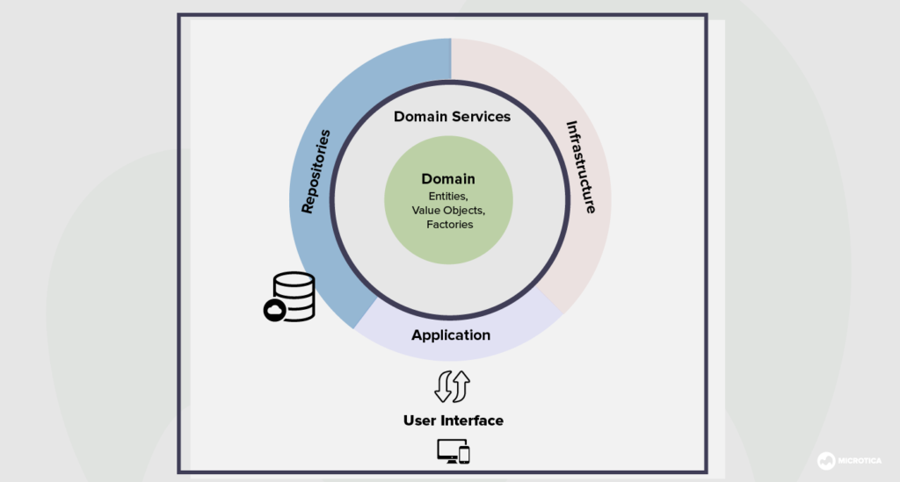
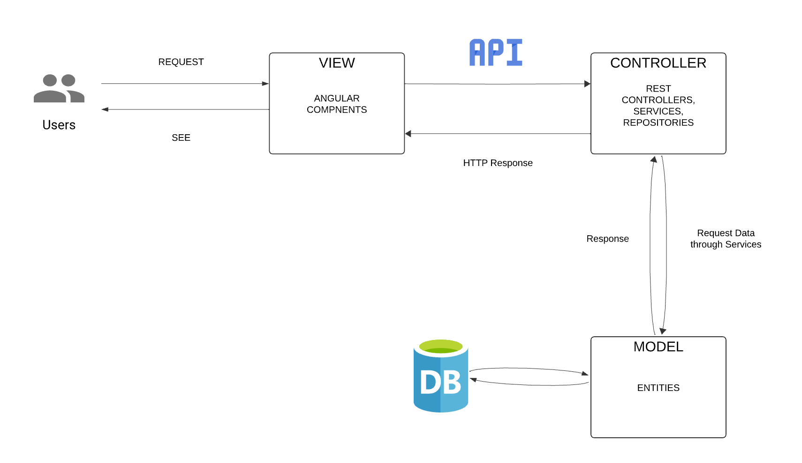
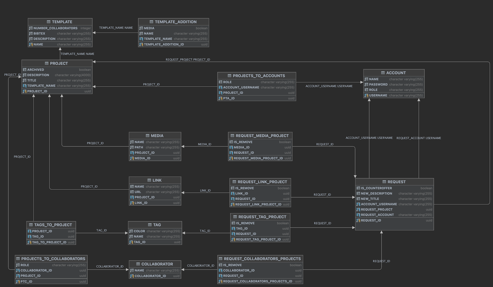

# Documentation

This document covers the features of About Project Portfolio Management System, it's options and how to use them.

# Requirements
- Git and Node and Angulat executable defined somewhere in your PATH, otherwise the Project Portfolio Management System will not be able to run.
- Node 
- Angular
- Java
- PrimeNG
- SpringBoot

# General information
 

Both the frontend and backend adhere to Domain-Driven Design (DDD) principles. 

- On the backend, each endpoint is managed by a dedicated controller and its corresponding service. The service layer handles the business logic, while the controller is responsible for directing traffic and managing HTTP requests and responses.
- On the frontend, the HTML implements the design UI, supported by TypeScript components and various services. These components and services ensure a dynamic and responsive user experience, integrating seamlessly with the backend.

# Backend

The backend is composed of three primary components:
- Commons Component: Constructs the database used to store the projects. Each common objects having a special UUID used to identification. 
- Controller Component: Directs traffic to the services and manages the flow of the endpoints. As well, they also provide detailed responses to the user.
- Service Component: Handles the endpoint business logic and also implements validation.

The [OpenAPI](openapi.yml) document was utilized to design and manage the endpoints that the frontend uses to query relevant data. There are 19 common data structures, each identified by a unique UUID. The backend logic is organized into 9 controllers and 9 services. Validation is performed at both the frontend and backend levels to ensure the database does not receive malicious requests. Each endpoint includes non-null checks and role-based permission controls. Additionally, certain JSON ignore annotations were implemented to prevent cyclical references between objects.

# Frontend
The frontend is composed of three primary components:

HTML Component: Responsible for rendering the user interface (UI) that users interact with.
- TypeScript Component: Implements the necessary logic and functionality that powers the dynamic behavior of the UI.
- Service Component: Manages the connection with the backend API, handling data retrieval and submission.
- Together, these components ensure a seamless and responsive user experience by effectively rendering the UI, executing business logic, and maintaining communication with the backend.

## Installation

The Project Portfolio Management System consists of two parts which need to be mandatory running on the same server in
order to ensure the cookies are not marked as third party (used for authentication):

- The backend (developed on Java using SpringBoot and JWT for authentication). For additional instructions for running
  the backend please
  visit [click here](https://gitlab.ewi.tudelft.nl/cse2000-software-project/2023-2024/cluster-b/02a/backend/-/blob/main/README.md?ref_type=heads).

- The frontend (developed on Angular using Nodejs) . For additional instructions for running the backend please
  visit [click here](https://gitlab.ewi.tudelft.nl/cse2000-software-project/2023-2024/cluster-b/02a/frontend/-/blob/main/README.md?ref_type=heads).

## Support

For additional bugs and/or additional new features please do not hesitate to contact us. Our team is happily to maintain
and improve this application.

